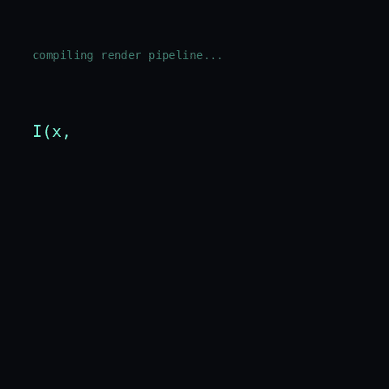

---

# Jyotirmoy Saikia

**B.Tech ETE (Class of 2026) · ML Systems & LLM Evaluation**

Distributed training infrastructure · RLHF & LLM evaluation · Full-stack AI applications

---

### About Me

I build the infrastructure layer where training efficiency meets model evaluation. My work spans hand-rolled multi-GPU training pipelines, LLM output evaluation at scale, and shipping full-stack AI products end to end — I like tracing a system down to the hardware trace, not just running it.

- Member of NASA Open Science Data Repository's Analysis Working Group (AWG). Active in the AI/ML AWG.
- 🔭 Worked as an **AI/ML Analyst at Outlier**, providing RLHF preference signal and cataloguing model failure modes across code generation, reasoning, and instruction-following tasks.
- 🧪 Selected for the **Research Intern at VLED Lab, IIT Ropar**.
- 🌍 Research collaborator at **MIT Critical Data**, under Dr. Leo Anthony Celi, M.D., M.S., M.P.H.
- 🎓 Selected for the **YEL Summer Cohort 2026**, from 2,000+ applicants across 73 countries.
- ⚡ I debug distributed training the hard way — I've reproduced and documented gradient explosions, CUDA OOM crashes, and silent `DistributedSampler` bugs, not just fixed them.

---

### Core Technologies

**Languages** — Python · TypeScript · React · MySQL

**ML / AI** — PyTorch (DDP, AMP, `torch.profiler`) · HuggingFace Transformers · RLHF / LLM Evaluation · LangChain · FAISS · Chroma · Prompt Engineering · NLP · Generative AI · LLMOps

**Distributed Training** — DistributedDataParallel · NCCL · GradScaler · Mixed Precision (AMP) · Multi-GPU Debugging · Hardware Profiling

**Infrastructure** — AWS · GCP · Docker · Git · Kaggle GPU Notebooks

---

### Featured Work

**🔧 [Multi-GPU DDP Training Deep Dive](https://www.kaggle.com/code/jyotirmoy32/transformer-training-on-2-t4-ddp-deep-dive)**
Built a 10M-parameter Transformer classifier from scratch and trained it with `DistributedDataParallel` across 2× NVIDIA T4 GPUs, measuring a 2.03× throughput speedup over a single-GPU baseline. Diagnosed and reproducibly fixed three real distributed-training failure modes — gradient explosion, CUDA OOM, and a silent data-shuffling bug — with `torch.profiler` traces included.

**🧠 [BERT Sentiment Classifier](https://www.kaggle.com/code/jyotirmoy32/bert-novel)**
Fine-tuned `bert-base-uncased` for review sentiment classification, with full training diagnostics: learning curves, hyperparameter ablations, and loss-spike root-causing down to input-length distribution and class imbalance.

**🎮 [AeroSim6 — 6-DOF Drone Flight Simulator](https://github.com/JyotiS34/AeroSim6)**
A physically accurate 6-degrees-of-freedom flight simulator built solo in Panda3D, with inertia-based dynamics, delta-time-scaled physics, and a modular architecture separating flight dynamics, input handling, and scene management.

**💬 [Team Documentation Q&A Chatbot](https://github.com/JyotiS34/Generative-AI-Workflow-with-LangChain-and-Vector-Store-for-Internal-Q-A-Bot)**
A Retrieval-Augmented Generation chatbot over internal technical documentation, using LangChain, FAISS, and Chroma with a custom chunking and re-ranking strategy for long-form retrieval precision.

**[Aurora](https://github.com/JyotiS34/Aurora-Webapp)**
A portfolio webapp showcasing an entity-aware BERT sentiment classifier — live demo, training deep-dive, and distributed pipeline visualisation.

**[AI Passport Consent Audit](https://github.com/JyotiS34/AI-Passport-Consent-Audit)**
An consent audit that reveals not just what permissions exist, but what your combined permissions actually expose about you across AI systems.

**[Aabir — AI Support Agent for @AmazonHelp](https://github.com/JyotiS34/aabir-support-agent)**
An AI customer-support agent that classifies intent, drafts grounded replies, and decides auto-handle vs escalate — built on real data from the Customer Support on Twitter dataset and cross-validated on Banking77.

---

### Achievements

- 🏆 Selected for **YEL Summer Cohort 2026** — 2,000+ applicants, 73 countries
- 🔬 Research Intern, **VLED Lab, IIT Ropar** (commencing August 2026)
- 🏥 Research under **Dr. Leo Anthony Celi**, MIT Critical Data
- 🎖️ **NEC Merit Scholarship** recipient
- ✅ Qualified on-campus interviews at ORC Engineering and ELEATION

